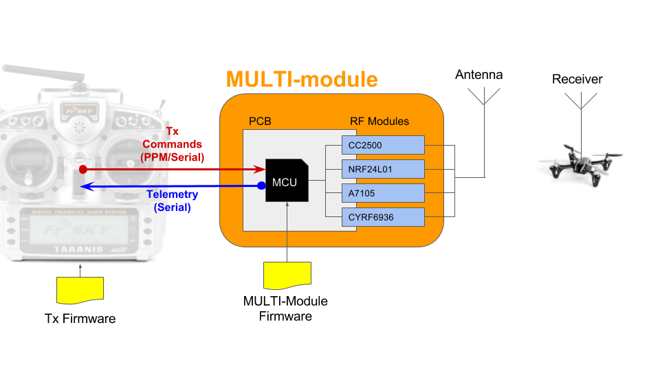

# Multiprotocol Tx Module firmware
This project has been forked from [DIY-Multiprotocol-TX-Module](https://github.com/pascallanger/DIY-Multiprotocol-TX-Module) with the aim to add a particular mode called "DSM_RADIO_INTERCEPT" to the original Multiprotocol FW. When the selected transmission protocol is DSMx and this specific feature is enabled, the module will listen for incoming signals from other radios in the area and, if any radio is found, the FW will take over the already transmitting radio, gaining control over its receiver.  
_Note that with this feature enabled, all binding operations will be disabled and FW will just keep on listening for other radios._

## Quicklinks
* [Compiling and Programming guide](https://github.com/pascallanger/DIY-Multiprotocol-TX-Module/blob/master/docs/Compiling.md)
* [The old documentation](https://github.com/pascallanger/DIY-Multiprotocol-TX-Module/blob/master/docs/README-old.md)
* [Radio control protocols overview](http://www.dronetrest.com/t/rc-radio-control-protocols-explained-pwm-ppm-pcm-sbus-ibus-dsmx-dsm2/1357)
* [DSM protocol explained](https://wiki.paparazziuav.org/wiki/DSM)
* [CYRF6936 datasheet](http://www.cypress.com/file/126466/download) [contains registers list]
* [CYRF6936 technical reference manual](http://www.cypress.com/file/136666/download) [chapter 10 contains register descriptions]
* [CYRF6936 to microcontroller interface - firmware example](https://sites.google.com/site/mrdunk/interfacing-cypress-cyrf6936-to-avr-microcontrollers) 

## System Overview
Harware blocks overview: 
 
*note: telemetry can be enabled only when interfacing with the radio using serial protocol*

The multi-module is in fact a micro-controller based board loaded with the Multiprotocol firmware. 
The firmware lets the board interface with 2 main HW components:
1. A host RC radio:
	- The module can interface with the Radio using PPM(Pulse Position Modulation) or Serial protocol.
2. A RF module that performs TX/RX operations to/from the model:
	- The module can interface with 4 different RF modules each one capable of handling several protocols to communicate with the receiver (in this in this particular implementation, DSMx protocol over CYRF6936 RF module is examined).  

## Resources
* [Original Multiprotocol code analysis](docs/analysis.md)
* [Some minor technical notes](docs/techref.md)

## FW Implementation:
- __Logical flow:__
	- Choose a fixed listening channel, set in receive mode and keep on checking if any other module is already transmitting. If any module is detected then:
		- Read the TxId from the already transmitting module;
		- Generate channel list using the detected TxId;
		- Start transmitting with the same channel sequence and TxId, anticipating the other radio by a fraction of time.
- __Tasks:__
	- [x] Make the DSM_RADIO_INTERCEPT mode selectable from _Config.h;
	- [x] Change Validate.h so that both CYRF chip and DSM protocol must be selected, and WAIT_FOR_BIND must be disabled in order to activate DSM_INTERCEPT_RADIO mode;
	- [x] Change setup sequence so that the new DSM_RADIO_INTERCEPT phases are selected before looping (if the feature is enabled);
	- [ ] Add DSM_RADIO_INTERCEPT logic into ReadDsm() by defining new phases (each phase corresponds to a case in ReadDsm main switch block);
		- [ ] Check how to read TxId from other radios and how to accordingly set tx_rx_address TODO  
		- [ ] Sync and Anticipate transmission TODO
	